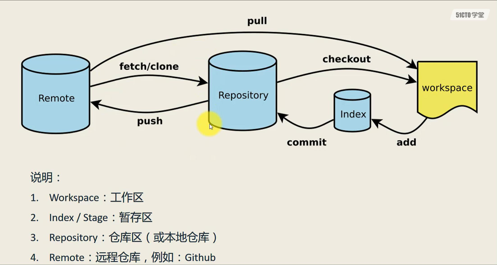
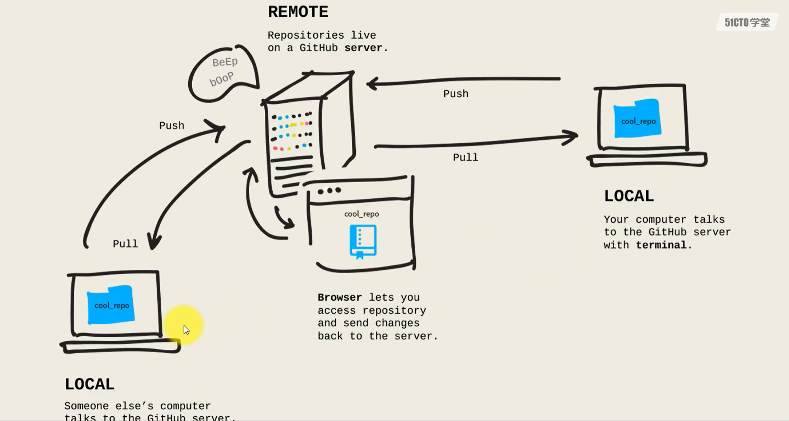

# commands

## 一、新建代码仓库

### 在当前目录新建一个Git代码库  

	git init

### 下载一个项目和它的整个代码历史

	git clone [url]  

(url格式：https://github.com/[userName]/reposName)

## 二、添加删除文件

### 添加指定文件到暂存区

	git add [file1] [file2]

### 删除工作区文件，并且将这次删除放入暂存区

	git rm [file1] [file2]

### 改名文件，并且将这个改名放入暂存区

	git mv [file-origin] [file-renamed]

## 三、代码提交

### 提交暂存区到仓库

	git commit -m [message]

### 直接从工作区提交到仓库（前提：该文件已经有仓库中的历史版本）

	git commit -a -m [message]

## 四、查看信息

### 显示变更信息

	git status

### 显示当前分支的历史版本

	git log

	git log --oneline

### 查看历史版本的详细信息

	git show [hash]

## 五、同步远程仓库

### 增加远程仓库，并命名(本地与远程建立关系)

	git remote add [shortname] [url]

### 将本地的提交推送到远程仓库

	git push [remote] [branch]

### 将远程仓库的提交拉下到本地

	git pull [remote] [branch]
	
## 六、git配置

### .gitignore

#### 强制添加.gitignore 忽略的文件
	
	git add -f <file name>
	
#### 查看.gitignore策略生效行号
	
	git check-ignore -v <file name>
	
### 换行符

* CR:carriage return回车，光标到首行，'\r'=return
* LF:line feed换行，光标下移一行，'\n'=newline
* linux:换行\n
* windows:换行\r\n
* MAC OS:换行\r

#### 提交时转换为LF，检出时转换为CRLF，默认设置不用修改，Git时linux配置
	git config --global core.autocrlf true
	
#### 允许提交包含混合换行符的文件
	
	git config --global core.safecrlf false